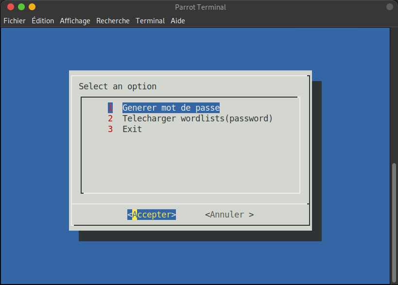
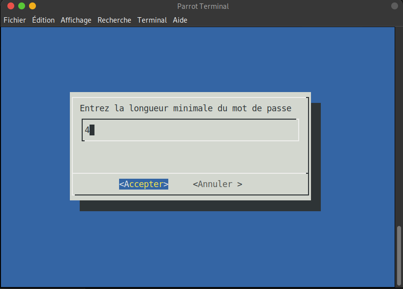
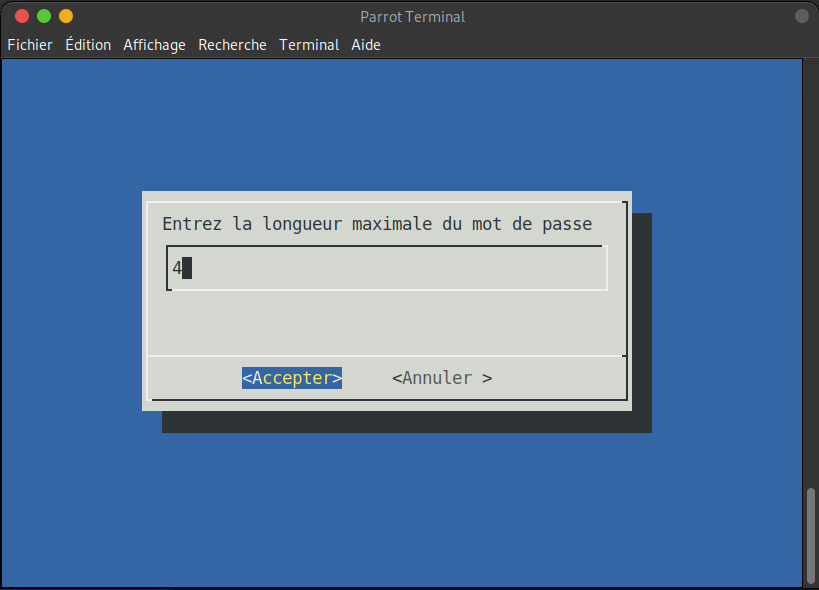
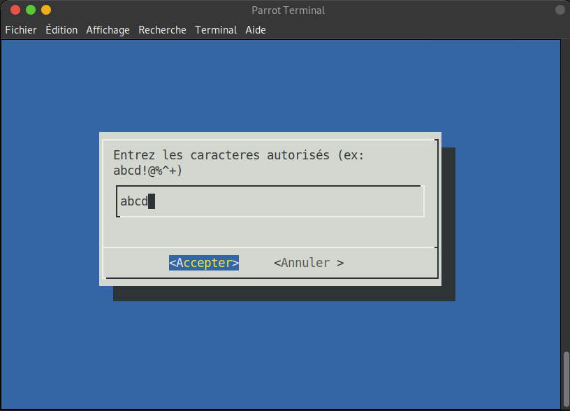
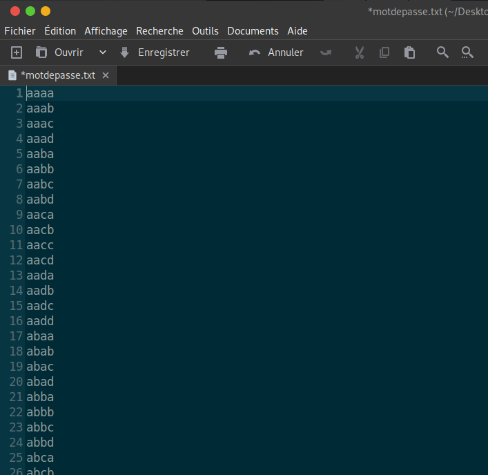
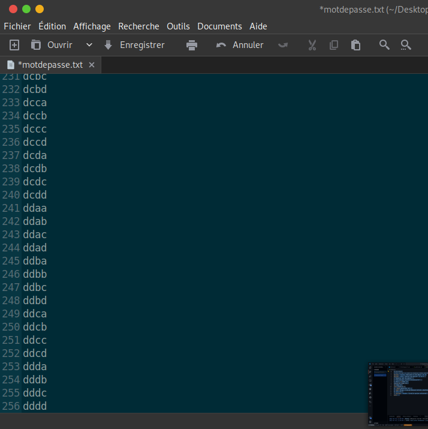

# Password-generator
Generate a password, and download existing dictionaries.
</br>
</br>







```bash
#!/bin/bash
dialog --msgbox "Bienvenue sur le generateur de mot de passe \n Veuillez Accepter pour continuer" 10 49
min=$(dialog --inputbox "Entrez la longueur minimale du mot de passe" 10 49 2>&1 >/dev/tty)
max=$(dialog --inputbox "Entrez la longueur maximale du mot de passe" 10 49 2>&1 >/dev/tty)
caract=$(dialog --inputbox "Entrez les caracteres autorisés (ex: abcd!@%^+)" 10 49 2>&1 >/dev/tty)
if [ -z "$min" ] || [ -z "$max" ] || [ -z "$caract" ]; then
    dialog --msgbox "Veuillez remplir tous les champs." 10 49
    exit 1
fi
if ! [[ "$min" =~ ^[0-9]+$ ]] || ! [[ "$max" =~ ^[0-9]+$ ]]; then
    dialog --msgbox "La longueur doit être un nombre entier." 10 49
    exit 1
fi
if [ "$min" -gt "$max" ]; then
    dialog --msgbox "La longueur minimale doit être inférieure ou égale à la longueur maximale." 10 49
    exit 1
fi
crunch "$min" "$max" "$caract" -o motdepasse.txt
if [ $? -ne 0 ]; then
    dialog --msgbox "Une erreur s'est produite lors de la génération du mot de passe." 10 49
    exit 1
fi  
if [ -z "$min" ] || [ -z "$max" ] || [ -z "$caract" ]; then
    dialog --msgbox "Veuillez remplir tous les champs." 10 49
    exit 1
fi
if ! [[ "$min" =~ ^[0-9]+$ ]] || ! [[ "$max" =~ ^[0-9]+$ ]]; then
    dialog --msgbox "La longueur doit être un nombre entier." 10 49
    exit 1
fi
if [ "$min" -gt "$max" ]; then
    dialog --msgbox "La longueur minimale doit être inférieure ou égale à la longueur maximale." 10 49
    exit 1
fi
crunch "$min" "$max" "$caract" -o motdepasse.txt
if [ $? -ne 0 ]; then
    dialog --msgbox "Une erreur s'est produite lors de la génération du mot de passe." 10 49
    exit 1
fi
dialog --msgbox "Le mot de passe a été généré avec succès et enregistré dans motdepasse.txt" 10 49
dialog --yesno "Voulez-vous afficher le mot de passe généré ?" 10 49
if [ $? -eq 0 ]; then
    dialog --textbox motdepasse.txt 20 50
fi
dialog --msgbox "Merci d'avoir utilisé le générateur de mot de passe." 10 49
rm motdepasse.txt
exit 0
# Fin du script
# Ce script utilise 'dialog' pour l'interface utilisateur et 'crunch' pour générer le mot de passe.
# Assurez-vous que 'dialog' et 'crunch' sont    installés sur votre système.
# Vous pouvez installer 'dialog' avec 'sudo apt install dialog' et 'crunch'
# avec 'sudo apt install crunch' sur les systèmes basés sur Debian/Ubuntu.
# Pour exécuter le script, assurez-vous qu'il est exécutable : chmod        +x run.sh
# Ensuite, lancez-le avec ./run.sh
# Le mot de passe généré sera enregistré dans le fichier motdepasse.txt.            
```